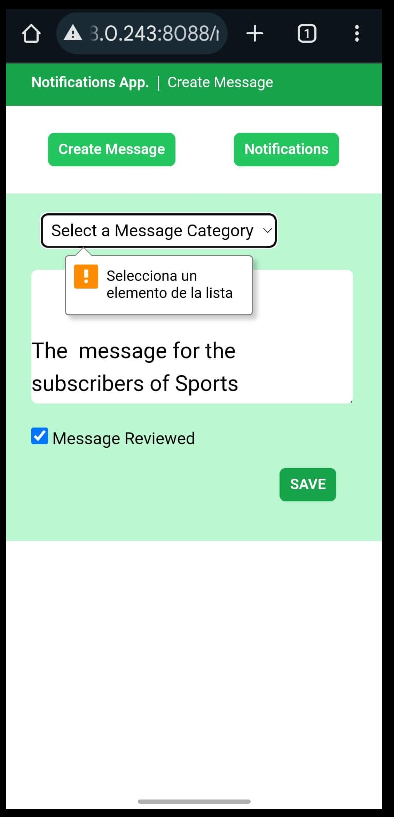
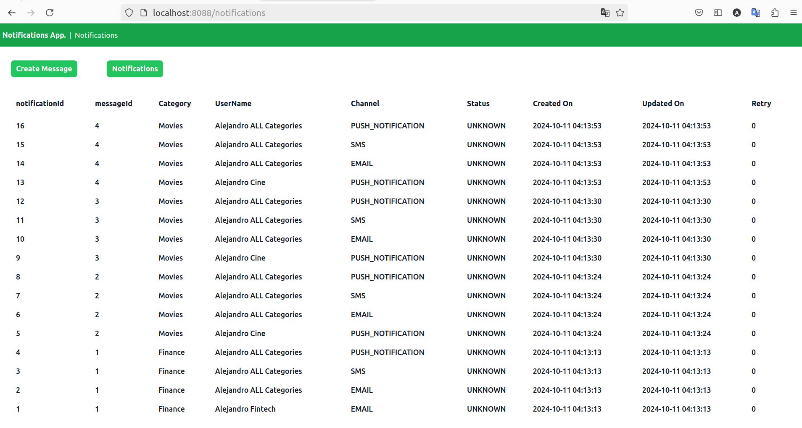

Notification App.

It is required to create a system capable of receiving messages, which will have a
category and the body of the message. These messages will need to be forwarded to
the system's users, who will already be pre-populated. In addition to being subscribed
to message categories, these users will have specified the channels through which they
would like to be notified, such as SMS, Email or Push Notification.
With this configuration, users will only receive notifications of messages that fall within
the categories they are subscribed to and through the channels they have specified.
There will be three message categories:

    • Sports
    • Finance
    • Movies

And there will be three types of notifications, each requiring its own class to manage
the sending logic independently:

    • SMS
    • E-Mail
    • Push Notification

It is necessary to design the architecture for sending notifications through various
channels. At a minimum, there should be one class for each channel, along with a
strategy to select the appropriate channel. Real messages need not be sent using third-
party services; the focus is on establishing a structure to implement the logic in the
future.

Additionally, it is essential to store all the relevant information required to verify that the
notification has been successfully delivered to the respective subscriber. This includes
details such as the message type, notification type, user data, timestamp, and any
other pertinent information.

No user administration is required, you can use a Mock of users in the source code, and
they must have the following information:

    • ID
    • Name
    • Email
    • Phone number
    • Subscribed [ ] here you need to list all the categories where the user issubscribed.
    • Channels [ ] a list of the notification's channels (SMS | E-Mail | Push Notification).

As a user interface, you must display 2 main elements.

1. Submission form. A simple form to send the message that contains 2 fields:
  

    • Category. List of available categories.

    • Message. Text area, confirm that the message is not empty.

<!-- 2. Log history. A list of all data records in the log, sorted from newest to oldest.-->

-----------------------------------------------------------------------------------------------

For buildeng the application uses:

      .   ____          _            __ _ _
     /\\ / ___'_ __ _ _(_)_ __  __ _ \ \ \ \
    ( ( )\___ | '_ | '_| | '_ \/ _` | \ \ \ \
     \\/  ___)| |_)| | | | | || (_| |  ) ) ) )
      '  |____| .__|_| |_|_| |_\__, | / / / /
     =========|_|==============|___/=/_/_/_/
     
     :: Spring Boot ::                (v3.3.4)

    -> JDK : 21

    -> HTTP Port : 8080

    -> MAVEN
   
    -> JDBC Client for DB Connection - H2

    -> Thymeleaf Java engine  for processing and creating HTML, XML, JavaScript, CSS and text

    -> HTMX a small JavaScript library that allows you to use custom attributes in HTML

    -> Dessign Pattern: Factory / Strategy for different notification channels like SMS, e-mail, Push notifications. 
    And Observer for the main objetive of Users receiving updates in their subsctipyed Message Categories.

    -> Git / Github :D and Git Flow

    -> Responsive Flex Design

    -> API REST

    -> Junit for Tests

20241010
Adding some testing results of the first Iteration:

The Log and some json files, related to users and categories are also uploaded in the root/xDocuments

In order to test creation of Messages, that fire the Notifications the User's that are Subscribed, using the REST API; this command can be executed:

    curl -X POST localhost:8088/api/messages -H 'Content-type:application/json' -d '{"categoryId": "2", "messageBody": "the boddy"}'

Latest Commit includes the Notifications Sent List:

